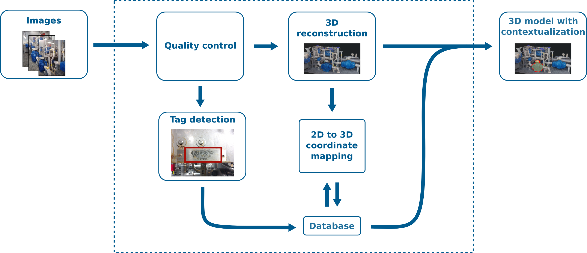

# Photogrammetry API

|The Photogrammetry API is highly experimental and some features may not be available or function correctly at the moment. Please use this API with care, as we issue no guarantees this API won't break.|
| --- |

In this tutorial we will go through how to use Cognite's Photogrammetry API to create contextualised 3D models using images.

The API reference is available here: [https://doc.cognitedata.com/api/playground/](https://doc.cognitedata.com/api/playground/)

### Background

In order to create contextualised 3D models we have developed a pipeline with several modular parts. First, images are uploaded as a zip file by the user. These images go through a quality control step, where low quality images (blurry) are filtered out. Next, the 3D reconstruction and tag detection steps are started. The former is done by using a method called photogrammetry, which uses overlapping images from a real-world object or scene to create a 3D model.

The tag detection is done in two steps. First we use Convolution Neural Networks (CNN) for detection of tags, and thereafter optical character recognition (OCR) is used for recognizing the tag text. In the last step, the image pixel coordinates extracted by the tag detector are mapped to 3D locations.

